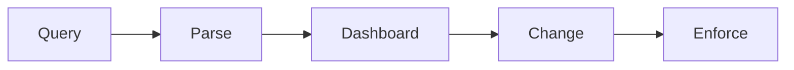

# fw-controller 🛡️⚡

  

*The Windows Firewall interface Microsoft forgot to ship.*

  

---

## 📖 Overview

In 2019, a sysadmin named nobody-important got tired of clicking through six layers of `wf.msc` just to block one noisy application from phoning home. Windows Firewall has always been powerful — genuinely one of the best host-based firewalls in the industry — but its interface was designed for a world before anyone cared about visibility, speed, or actually understanding what their rules were doing. `fw-controller` was born as a weekend fix for that problem. It stayed a weekend project for exactly one weekend.

Today, `fw-controller` is a standalone control panel that sits directly on top of the native Windows Filtering Platform. It doesn't replace your firewall — it replaces the *pain* of managing it. Every rule, every port, every inbound and outbound decision your machine makes is surfaced in one dashboard, searchable, editable, and exportable. No cloud dependency, no telemetry phoning out to some vendor's servers, no subscription wall.

It's built for people who actually think about their attack surface: developers running local servers, gamers punching holes for peer-to-peer traffic, small IT teams managing a handful of endpoints, and privacy-conscious users who want to *see* what's trying to talk to the internet before deciding whether it should. If you've ever typed `netsh advfirewall` from memory, this tool was made for you.

---

## 🔥 What It Actually Does

1. **Rule Visualizer** — Every inbound and outbound rule rendered as a readable table, not a wall of GUID-riddled dialog boxes.

2. **One-Click Profiles** — Switch between Home, Work, and Lockdown network profiles without touching Control Panel.

3. **Live Traffic Pulse** — A real-time feed of connection attempts, color-coded by allow/block decision, so you know what's knocking before you answer.

4. **Application Gatekeeper** — Search installed apps and toggle their network access with a single switch, no manual executable path-hunting.

5. **Port Watchtower** — Visual map of open, closed, and listening ports, updated live, with a right-click shortcut to seal any of them.

6. **Rule Snapshots** — Export your entire ruleset to a portable file and restore it instantly on a fresh machine or after a bad experiment.

7. **Conflict Detector** — Flags overlapping or contradictory rules that silently cancel each other out — a problem native tools never warn you about.

8. **Geo-Aware Blocking** — Tag rules by region so you can restrict traffic by geography without hand-writing IP ranges.

9. **Audit Log Timeline** — Chronological history of every rule change, who triggered it, and when — accountability built in, not bolted on.

10. **Silent Mode** — Runs minimized in the tray, surfacing only when a rule decision needs your attention.

> [!TIP]
> Start in **Lockdown Profile** on a new machine, then whitelist outward from there. It's far faster than auditing an already-open system.

---

## 🚀 Getting Started

1. Visit the landing page and grab the latest build — the button above takes you straight there.

2. Run the executable. No installer wizard, no bundled toolbar offers, no dependency chain.

3. Launch `fw-controller` — it detects your existing Windows Firewall rules automatically and imports them into the dashboard.

4. Pick a profile, review the flagged conflicts (if any), and you're managing your firewall visually from that point forward.

> [!NOTE]
> `fw-controller` reads and writes through the same Windows Filtering Platform APIs as the native firewall. Nothing you do here is hidden from `wf.msc` — it's the same rules, just a better window into them.

---

## 🖥️ System Requirements

| Requirement | Details |
|---|---|
| OS | Windows 10 (64-bit) or Windows 11 |
| Dependencies | None — fully standalone executable |
| Disk Space | Under 50 MB |
| Privileges | Administrator (required to modify firewall rules) |
| Internet | Not required after download |

  

---

## ⚙️ How It Works

`fw-controller` doesn't reinvent firewall enforcement — it re-skins and reorganizes the decision-making pipeline that Windows already runs on every packet.

1. The app queries the Windows Filtering Platform for existing rules on launch.

2. Rules are parsed into a normalized model the dashboard can render and diff.

3. Any change you make in the UI is translated back into native firewall API calls.

4. The Windows Filtering Platform enforces the updated rule immediately — no restart, no service bounce.

5. The audit log timeline records the change for later review.

> [!IMPORTANT]
> Because enforcement happens through native Windows APIs, `fw-controller` closing or crashing does **not** remove your existing rules. Your firewall stays exactly as configured.

---

## 🧩 Troubleshooting

<strong>The app won't launch — nothing happens on double-click.</strong>

Right-click and choose "Run as administrator." Firewall rule changes require elevated privileges, and Windows silently refuses to launch without them in some configurations.

<strong>My rules disappeared after switching profiles.</strong>

They didn't — profiles are scoped views, not deletions. Switch back to the profile that owned the rule and it reappears in the dashboard.

<strong>Conflict Detector is flagging a rule I need.</strong>

A flag means two rules contradict each other, not that either is wrong. Review both, keep the one with the correct scope, and remove or narrow the other.

<strong>Live Traffic Pulse shows nothing.</strong>

Confirm you're running as administrator — the packet capture layer that powers the pulse feed requires elevated access to attach to the network stack.

<strong>Can I run this alongside third-party antivirus firewalls?</strong>

Yes. `fw-controller` only manages the native Windows Filtering Platform rules. Third-party firewall software has its own independent rule engine.

> [!WARNING]
> Applying a **Lockdown Profile** on a remote machine without a fallback plan can cut off your own remote session. Always whitelist your management port first.

---

## 🎨 UI & UX Details

**Themes:** Light, Dark, and a high-contrast mode for low-vision accessibility.

**Keyboard shortcuts:**

- `Ctrl+F` — Search rules instantly
- `Ctrl+N` — Create new rule
- `Ctrl+L` — Toggle Lockdown Profile
- `Ctrl+E` — Export current ruleset
- `Esc` — Close active dialog

**Settings panel** lets you adjust refresh interval for Live Traffic Pulse, default rule scope, and whether the app minimizes to tray or taskbar on close.

> [!NOTE]
> All UI preferences are stored locally in a config file next to the executable — nothing is written to the registry beyond what Windows Firewall itself requires.

---

## 🤝 Contributing & Community

`fw-controller` grew from one person's annoyance into a project maintained by contributors who share the same itch. Issues, feature requests, and pull requests are welcome.

1. Fork the repository.
2. Create a feature branch.
3. Open a pull request with a clear description of the change and the reasoning behind it.

> [!TIP]
> Bug reports that include your Windows build number and a screenshot of the Conflict Detector (if relevant) get triaged fastest.

---

## 📄 License

Released under the [MIT License](LICENSE), 2026.

---

## ⚠️ Disclaimer

`fw-controller` is provided as-is, without warranty of any kind. It is a management interface for the native Windows Filtering Platform — it does not replace sound network security practices, and misconfigured rules can restrict legitimate traffic or leave gaps if applied carelessly. Use responsibly and understand any rule before applying it.

---

